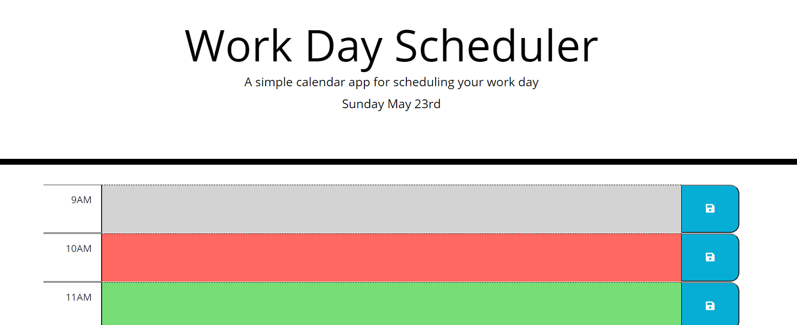

# Work Day Scheduler

## Summary
#### The program allows you input text for every standard bussiness hour (9AM to 5PM). when press save it will save local storage. it will also highlight current hour as red, past as grey and future as green.

## Techonolgies
#### HTML, CSS, Javascript, MomentJS and Jquery

## Instalation/Website
#### https://szali3.github.io/WorkDay-Scheduler/

## Contributor
#### Zohaib Ali